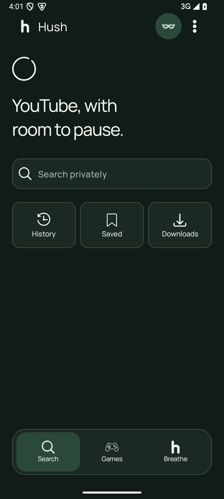
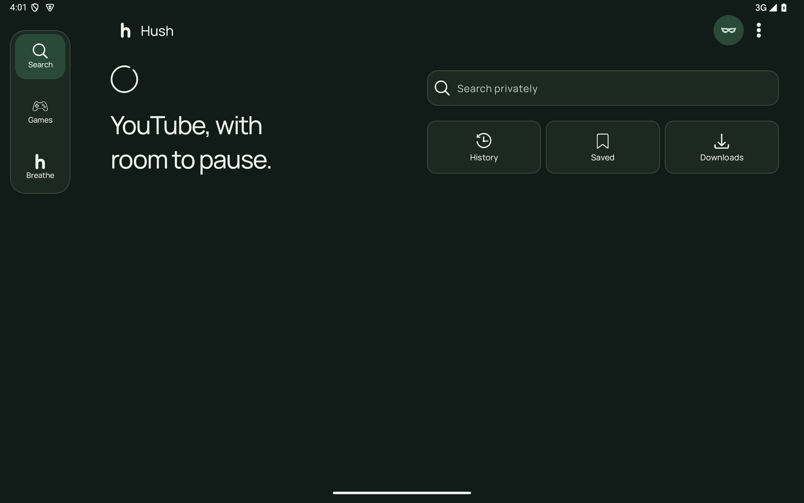
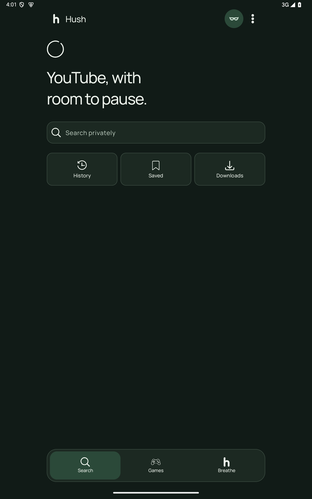
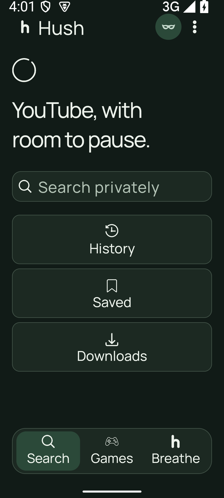
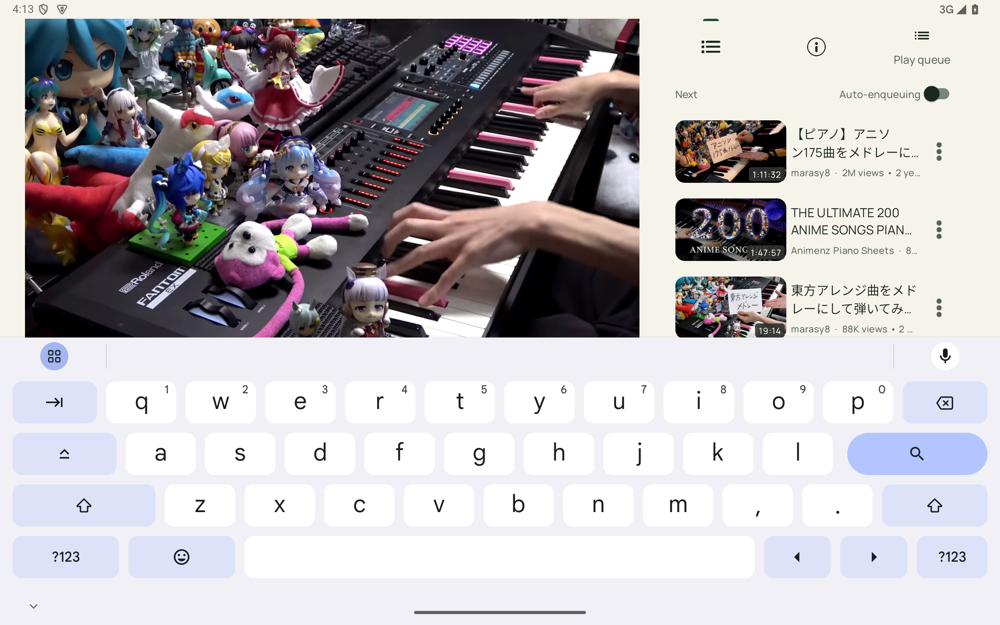

# Hush 1.0.4 fixes

## Home shortcuts

History, Saved (bookmarks), and Downloads use equal-width cards, 8dp gutters,
centered 24dp icons, and an explicit 8dp icon-to-label gap. Empty recent-query
content is hidden, leaving 16dp between search and shortcuts. The same cards
stack at large font sizes or when their complete labels cannot fit in three
columns. The existing Home scroll and video overlay behavior remain intact.

| Mobile | Tablet landscape | Tablet portrait |
| --- | --- | --- |
|  |  |  |

## Snake

Moving through any edge enters the opposite edge on the same row or column.
Self-collision still ends the round; food, growth, buffered steering and the
vacated-tail rule still apply. Saves validate adjacency across the seam so
wrapped rounds can resume. Rendering takes the one-cell path through the edge
and draws its clipped continuation on the opposite side, avoiding a sweep
across the board.

## YouTube playback crash

The user report's `Fragment already added: DescriptionFragment` was reproduced
by requesting the description tab twice before `finishUpdate` commits it.
`FragmentPagerAdapter` cannot find a pending add by its stable tag. TabAdapter
now reuses the pending instance within that update and clears the cache after
the outermost commit, including reentrant lifecycle callbacks. This prevents
scheduling two adds for the same fragment rather than catching the crash.

Regression: `TabAdapterRegressionTest` covers duplicate instantiation plus ten
replacement/removal/rebuild cycles. The original reproduction failed with the
reported exception and passes after the fix. See the before log in the proof
folder.

## Validation

- 40 JVM tests passed, including four-edge wrapping, wrapped save/load, eating
  at the seam, self-collision and existing game behavior.
- Eight native Home/wrap checks passed across mobile, both tablet orientations
  and 200% text size. Screenshots were inspected for clipped labels and gutters.
- Two tab adapter regressions and ten game interaction/performance checks passed.
- The real YouTube playback/overlay continuity check passed. One combined run
  timed out waiting for a live stream; its isolated retry passed (logs retained).
- Signed 1.0.4 APK opened the YouTube Watch page and played real video past 24 seconds; the description tab was opened without the reported crash.
- Signed release APK build succeeded for every ABI; names, version 1.0.4,
  codes 501–504 and the preserved signing certificate were verified.

Reproduce the layout/wrap checks after building debug and androidTest APKs:
`python3 scripts/verify-home-snake.py`. Native tests use the headless emulator
on port 5558 and restore game/privacy state. No physical device data was changed.
