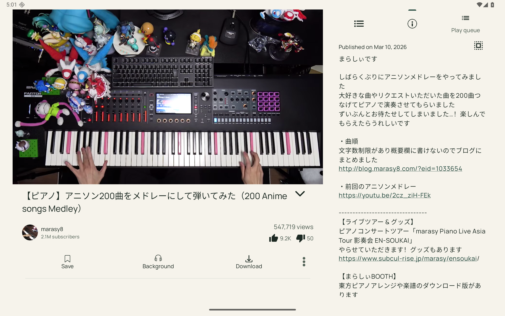

# Hush 1.0.5: Watch fragment lifecycle fix

## What 1.0.4 missed

The user's Android 16 ACRA report matches the 1.0.4 release's R8 mapping ID.
This is a recurrence in that build, rather than a report from an older APK.
The pending-item cache fixed two calls to instantiate the same tab, but did
not prevent replaying a transaction after a lifecycle callback interrupted it.

A deterministic native reproduction uses a real ViewPager and the Watch-style
child FragmentManager. A nested transaction during DescriptionFragment's
creation interrupts the initial commit. The old adapter silently catches the
first exception, retains FragmentPagerAdapter's partially executed transaction,
and retries its ADD during ViewPager.onMeasure. That reproduces the exact
`Fragment already added: DescriptionFragment` stack from the report.

The nested callback is fault injection: the ACRA excerpt does not include the
preceding error, so it cannot identify which callback initially interrupted the
user's update. A separate refresh-during-attachment test also exposed the old
adapter's immediate remove attempting a nested commit. Both unsafe adapter
paths are removed. Unrelated lifecycle failures are reported at their origin
rather than swallowed and converted into a later duplicate-add crash.

## Implementation

- TabAdapter owns the pager's complete add/remove transaction. It no longer
  combines FragmentPagerAdapter's pending add with an independent immediate
  remove. Pending operations are released before commit, including on failure;
  the next measurement cannot replay the executed ADD.
- Repeated instantiation shares the desired fragment. Replacements retain their
  own identity, rather than recovering a previous description by a title hash.
- Tab changes during lifecycle callbacks publish on the next main-thread turn.
  ViewPager sees a complete snapshot while the current commit runs.
- Watch builds/replaces its tab set in a batch. Icons, accessibility labels,
  visibility and queue actions refresh after the completed publication.
- When the Watch view is recreated, old children in its dedicated pager
  container are removed; the parent restores the stream and selected tab.
  A description from the old stream cannot override the replacement.
- Destroying the Watch view cancels deferred updates and their listener.

This does not change media extraction, decoding, playback controls or overlays.
The existing user-visible-hint behavior of legacy tabs is preserved.

## Verification

- Before: the interrupted-population regression crashes the 1.0.4 adapter with
  the exact DescriptionFragment duplicate-add stack. [Crash](assets/hush-1.0.5-crash-proof/before-crash.txt),
  [instrumentation](assets/hush-1.0.5-crash-proof/before-instrumentation.txt).
- After: all six adapter regressions pass on the headless Android 15 tablet.
  They cover repeated instantiation, ten replacement/reordering/rebuild cycles,
  attachment-time refresh, interrupted commit, deferred replacement actually
  attaching, and child fragments surviving a destroyed/recreated Watch view.
  [Result](assets/hush-1.0.5-crash-proof/android15-tabs.txt).
- Android 16 / API 36: those six regressions plus the actual Watch lifecycle test
  pass. The latter loads 12 cached metadata fixtures through the normal Watch
  flow, rotates, and explicitly recreates MainActivity four times. It checks
  the current video's description and exactly one attached description.
  Fixtures are test-only, not illustrative metadata shown in release UI.
  [Result](assets/hush-1.0.5-crash-proof/android16-tabs.txt).
- Android 16: both local-fixture decoder continuity and real YouTube playback
  tests pass through floating browsing and expansion. [Result](assets/hush-1.0.5-crash-proof/android16-playback.txt).
- The signed 1.0.5 ARM64 release was installed on both headless tablets. Android
  15 upgraded directly from 1.0.4. On Android 16, actual YouTube playback reached
  1:40 with Description selected and no matching fragment-crash log entries.
  [Verification](assets/hush-1.0.5-crash-proof/signed-release-verification.json).
- All five ABI/universal APKs passed signature, package-version and version-code
  checks with the preserved certificate. [Hashes and metadata](assets/hush-1.0.5-crash-proof/apks.json).
- APKHub build 17 is the latest universal candidate. Its complete HTTPS download
  matches the local APK's size and SHA-256. [Verification](assets/hush-1.0.5-crash-proof/apkhub.json).
- All 40 JVM tests pass; no physical device data was modified.



Run after assembling and installing debug and androidTest APKs:

```sh
adb -s emulator-5560 shell am instrument -w \
  -e class org.schabi.newpipe.fragments.detail.TabAdapterRegressionTest,org.schabi.newpipe.fragments.detail.WatchTabsLifecycleTest \
  com.vidsagar.hush.debug.test/androidx.test.runner.AndroidJUnitRunner
```

The deterministic interrupted-commit test is
`TabAdapterRegressionTest#abortedDescriptionPopulationDoesNotReplayCommittedAdds`.

## Release candidate

Version 1.0.5, base code 6: 601 armv7, 602 x86, 603 x86_64 and 604 ARM64/universal.
Use the preserved Hush signing certificate. The public GitHub release remains
1.0.2; building or uploading this candidate to APKHub does not create a GitHub
release/tag. See [release rules](RELEASE.md) for signing and migration guidance.
