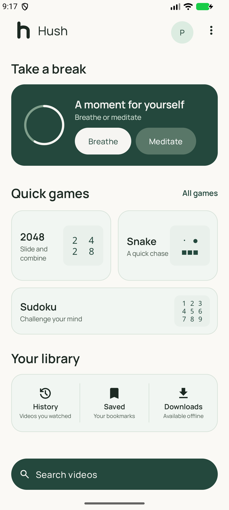
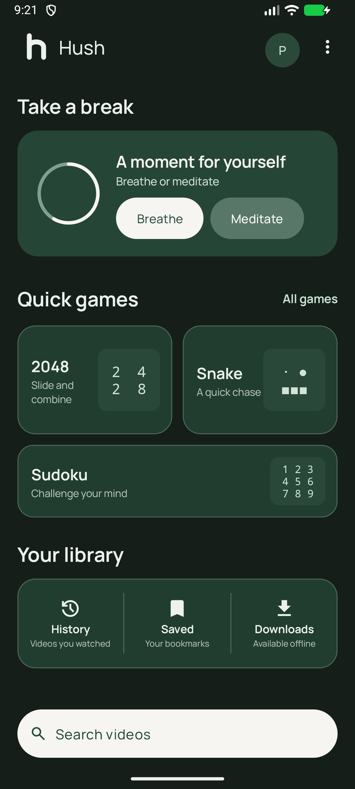
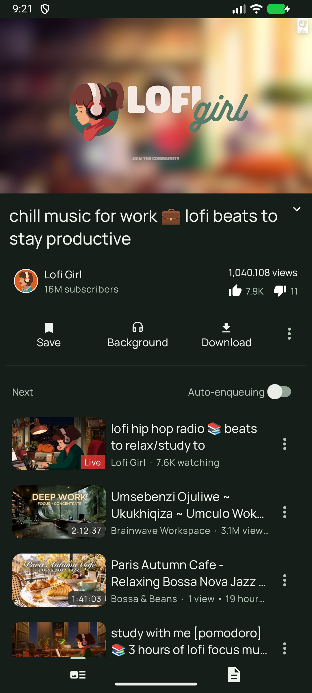
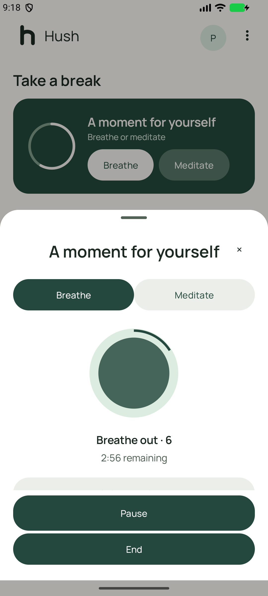
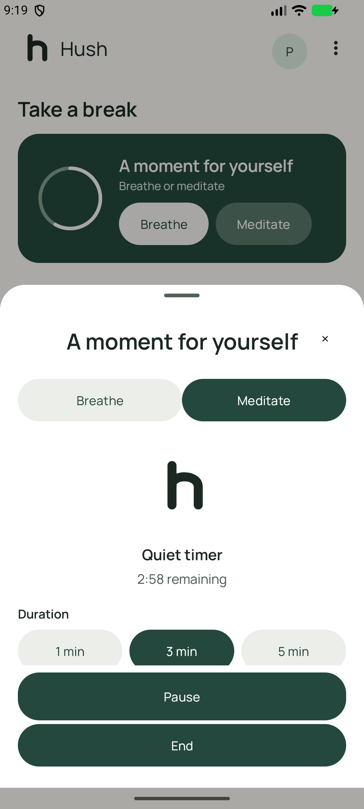
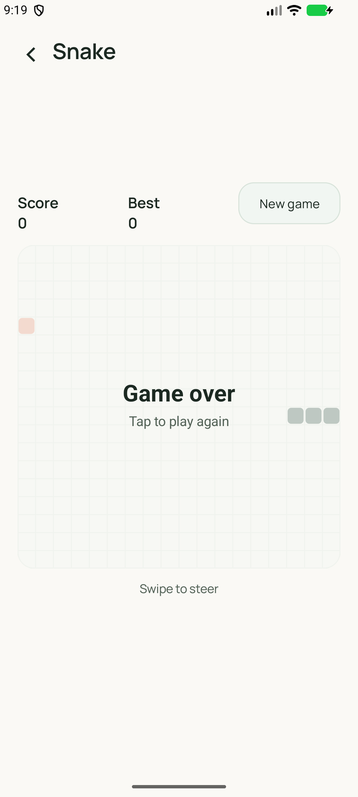
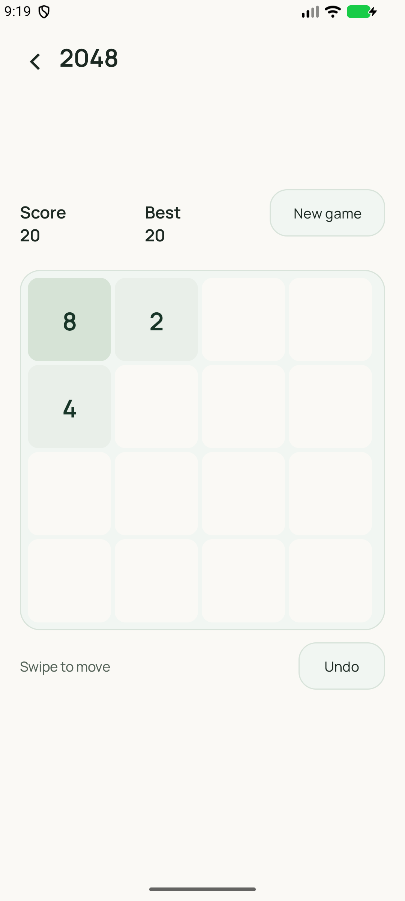
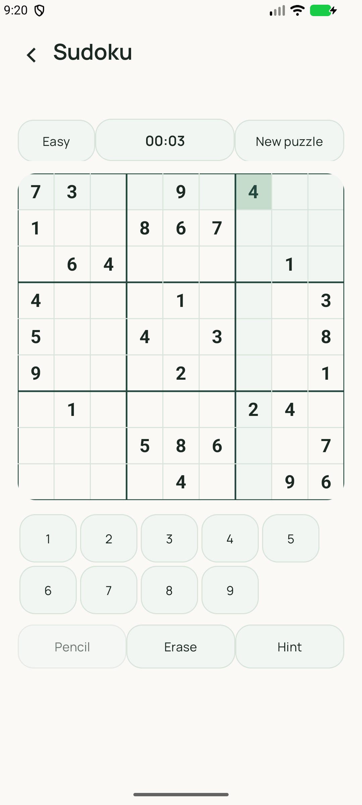
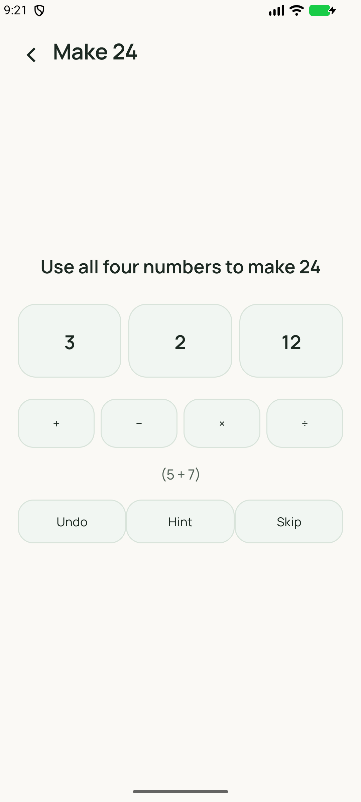

# Hush

**A calm, private YouTube client for Android — watch what you need, then take a breath.**

Hush is a personal rebuild of the open-source NewPipe lineage (NewPipe → PipePipe) around one idea:
your video app shouldn't be a slot machine. The Home screen offers a break instead of an endless
feed, quick offline games instead of shorts, and your library instead of recommendations — while
a full-featured, gesture-driven player stays one tap away.

All screenshots below are real captures from the app running on a device.

## Screenshots

| | | |
| :---: | :---: | :---: |
|  |  |  |
| *Home — warm paper* | *Home — dark pine* | *Watch page* |
|  |  |  |
| *Breathe session* | *Meditate timer* | *Snake — swipe to steer* |
|  |  |  |
| *2048* | *Sudoku* | *Make 24* |

## What's inside

**A quiet Home**
- *Take a break* card with **Breathe** and **Meditate** — the home never starts a session by itself.
- Quick games (2048, Snake, Sudoku, Make 24) as calm, tap-sized entry points.
- History, Saved, and Downloads in one grouped library card. No feed, no recommendations,
  no "up next" on Home — that content lives where you looked for it.
- A fixed, high-contrast search field that stays above the keyboard and the navigation bar.

**Breathe & Meditate**
- Clock-driven breathing engine: Calm (4 in / 6 out), Box (4·4·4·4), and 4·7·8, with a phase ring,
  per-phase countdown, and soft local cues you can mute.
- A quiet meditation timer with start/completion chimes and a still visual.
- 1, 3, or 5 minutes; sessions end exactly at the chosen time. Backgrounding pauses the session,
  rotation keeps it, and your player keeps playing underneath — cues never pause or seek media.
- Reduced-motion friendly: with system animations disabled, phase text and timing update without
  orb motion.

**Offline games** (no ads, no sounds, no network)
- **2048** — swipe to merge, undo, best score, Continue or Finish at 2048.
- **Snake** — swipe to steer, tap the board to pause/resume; fully touch-driven, no D-pad.
- **Sudoku** — bundled one-solution Easy/Medium puzzles, pencil notes, conflict highlighting,
  hints, and a pauseable timer.
- **Make 24** — fraction-exact arithmetic rounds, every round verified solvable, with hints and undo.
- Game progress is saved per profile, paused when you leave, and never written in incognito.
- Background playback keeps a compact control bar above the game; game gestures never touch it.

**A proper player**
- Unified Fit/Zoom video geometry for every surface (embedded, fullscreen, popup), honoring pixel
  aspect ratio and rotation — circles stay circles.
- Single tap for controls, side double-tap for ±10 s, swipe-to-seek with thumbnail previews,
  swipe-to-fullscreen, pinch crop in fullscreen, side brightness/volume gestures.
- One Playback sheet in both orientations: Quality, Speed, Captions, and Display in one place.
- Legacy "Fill" preferences migrate to Fit — stretched video is gone by design.

**Privacy & profiles**
- No Google account, no play services required, no telemetry. Subscriptions and history stay local.
- Multiple local profiles (each with its own sessions), and an incognito mode that writes nothing.

**Design**
- Warm paper / dark pine Material 3 themes that follow the system setting.
- [Manrope](assets/licenses/manrope_ofl.txt) for type (OFL licensed, bundled), 48 dp touch targets,
  and layouts that reflow — not clip — at large font sizes and narrow screens.

## Building

Requirements: JDK 17+, Android SDK. This is a standard Gradle project — open it in Android Studio,
or create `local.properties` with `sdk.dir=/path/to/android-sdk` and build from the command line.
The ffmpeg-kit AAR is not committed; the first build downloads it from the project's GitHub
release and verifies a pinned SHA-256 checksum, so a clean clone builds out of the box:

```bash
# debug APK
./gradlew :app:assembleDebug

# signed release (expects keystore.properties, see app/build.gradle for the expected keys)
./gradlew :app:assembleRelease

# unit tests (breathing engine + game engines)
./gradlew :app:testDebugUnitTest
```

The extractor lives in `extractor/` as an included Gradle build; no extra setup is needed.

## Project layout

| Path | What it is |
| --- | --- |
| `app/` | The Android application (player, home, break sheet, games, storage) |
| `extractor/` | The streaming extractor (YouTube-only fork of NewPipeExtractor) |
| `ffmpeg/` | Native ffmpeg module used by the app |
| `screenshots/` | Real screen captures used in this README |

## Credits & license

Hush is a derivative work of two great open-source projects and is licensed under the
**GPL-3.0** (see [LICENSE](LICENSE)):

- [NewPipe](https://github.com/TeamNewPipe/NewPipe) and the NewPipeExtractor — the foundation.
- [PipePipe](https://github.com/InfinityLoop1308/PipePipe) by InfinityLoop1308 — the fork this
  project started from, including its extractor work.
- [Manrope](https://github.com/google/fonts/blob/main/ofl/manrope/OFL.txt) typeface, under the
  SIL Open Font License.

Hush is not affiliated with YouTube, Google, or any service it interfaces with. Use it
respectfully within the terms of the services you access.
