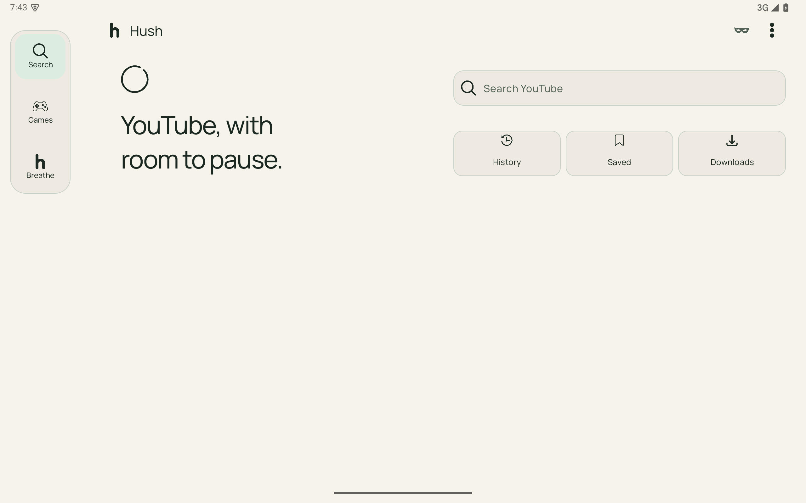
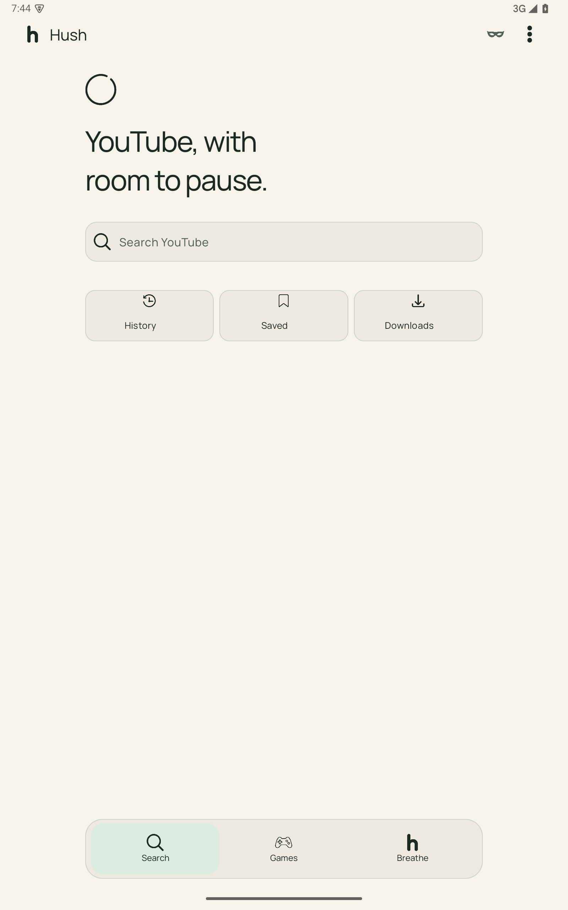
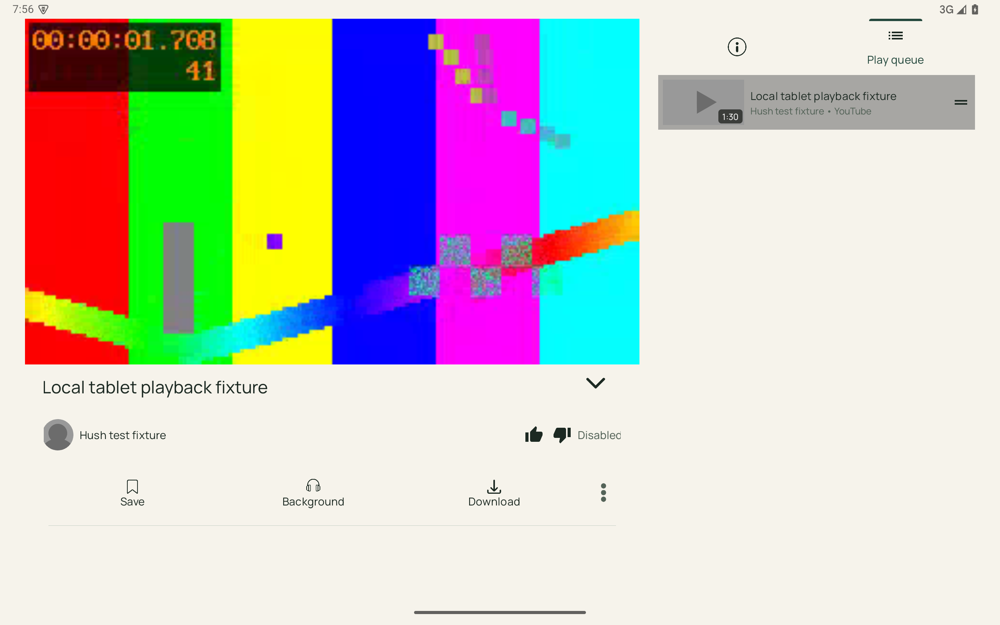
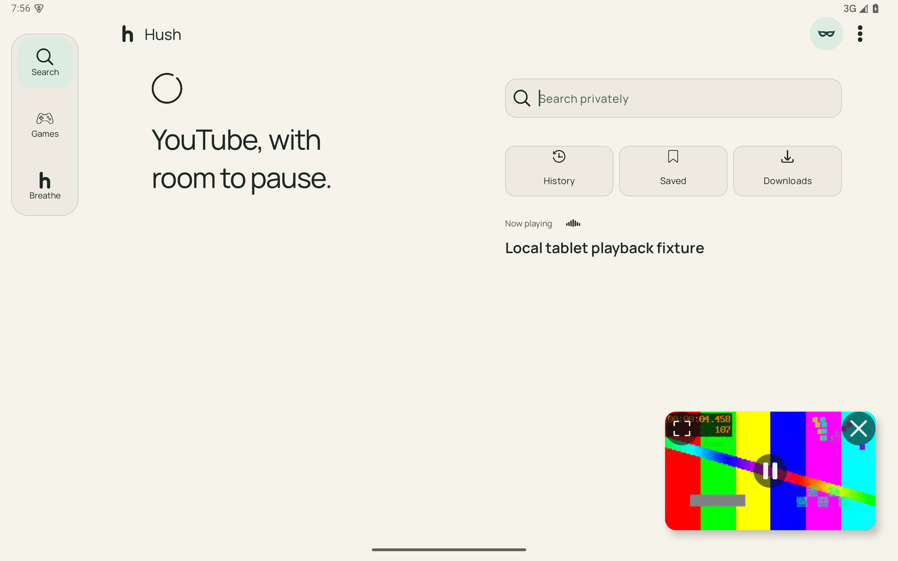
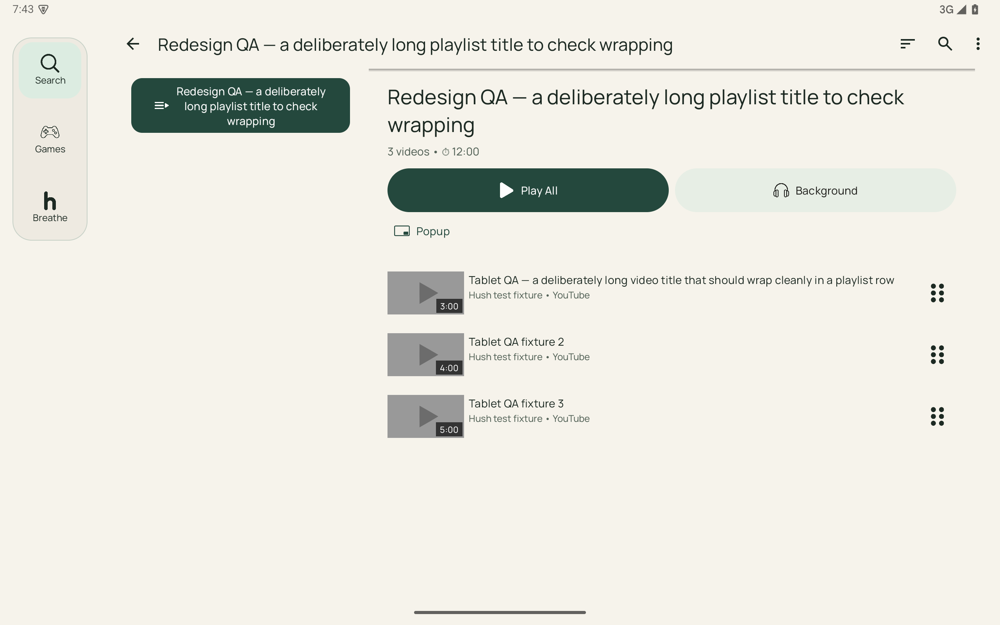
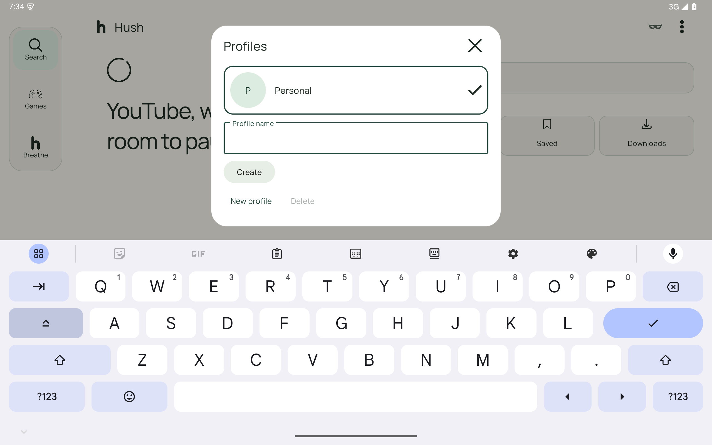
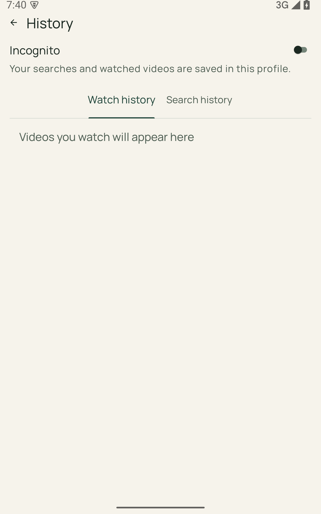
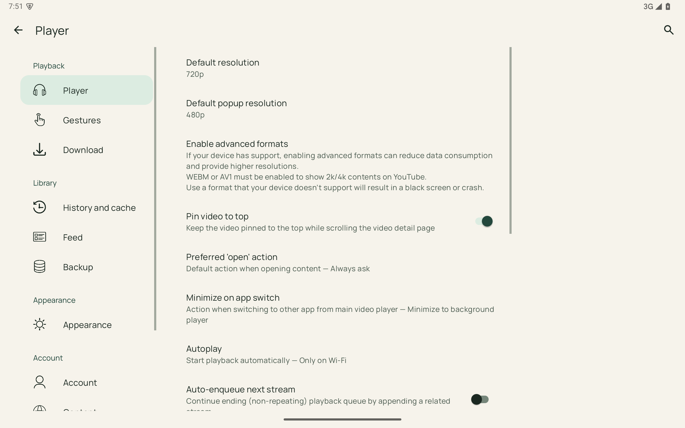
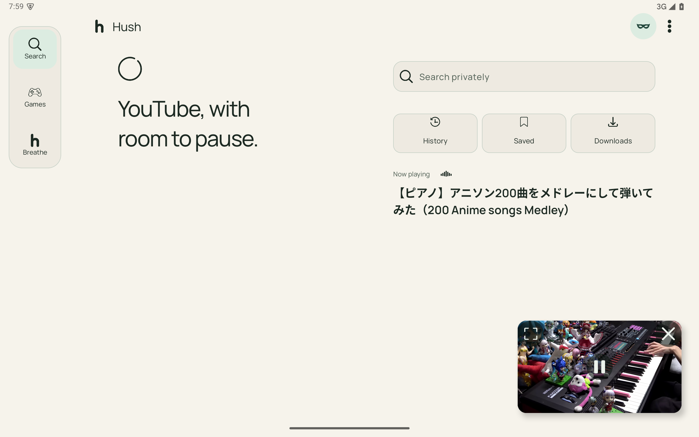

# Hush tablet implementation

Implementation phase: 1 October 2026. Android source now implements the tablet compositions from [the design plan](TABLET_DESIGN_PLAN.md). The earlier 34 imagegen images remain design references; they are not shipped as raster application screens.

[Actual emulator screenshot gallery](assets/hush-tablet-implementation-proof/gallery.html) · [Generated design references](assets/hush-tablet-mockups/gallery.html) · [Existing icon mappings](ICON_PLACEMENT_GUIDE.md)

## What changed

| Area | Before this phase | Implemented behavior and code |
| --- | --- | --- |
| Navigation | Phone bar stretched across tablet windows | `TabletLayout` and `HushChrome` select a 96dp rail for landscape windows at least 840dp wide. Other windows get a centered, bounded 560dp bottom bar with equal margins. Safe insets, keyboard and expanded Watch govern visibility. MainActivity reserves rail space for both toolbar and content. |
| Home | Phone composition enlarged across the window | HomeDashboard places a bounded hero beside search, recent queries and native library shortcuts. Portrait stacks aligned groups. Recent searches, privacy and playing metadata use actual session/database data. Background audio gets an in-flow card with Audio only, Pause/Play, Queue and Close. |
| Search | Fixed grid column count | Grid columns follow measured content width, with a single readable column at large text. Existing editable query, suggestions, filtering and error states remain. Expanded Watch contains no search field. |
| Floating playback | Phone-size floating card and incomplete content clearance | One existing player view is reparented into a 16:9 card: 300dp tablet, 240dp narrow, 208dp compact before safe-rectangle fitting. Expand, Pause/Play and Close have 48dp targets. Resize, IME, navigation and session controls constrain its placement. Browsing reserves its height plus 24dp; modal dialogs hide the presentation temporarily. |
| Watch | Video and metadata did not form useful tablet panes | Wide Watch uses pinned video and independently scrolling metadata on the left, native tab content and a session queue on the right. Tabs move to the top of the wide pane. Portrait restores native stacked content. Fullscreen and Watch hide top-level navigation. The same decoder survives collapse and expansion. |
| Saved | A single playlist list, separate detail route | Wide Saved hosts a selected native playlist beside the selector. Empty libraries use the available width. Compact windows keep the existing detail route. Selection, detail fragment and selector scroll survive pane visibility changes. Standalone playlist detail also supports the tablet selector. Native rows, playback, reorder and removal actions are retained. |
| Profiles | A phone bottom sheet | A centered modal capped at 520dp, with 64dp avatars, selected state, a scrolling body and pinned header/actions. Keyboard-safe sizing retains the name field and creation action. Blank names show an error; default-profile deletion stays visibly disabled. Existing profile storage and isolation remain. |
| History | Header occupied scarce vertical space at large text | Privacy/title/tabs become part of scrolling content for short or large-text windows, including an empty history. Existing watch/search histories and deletion controls remain native. |
| Games | Boards and controls reused phone arrangements | Bounded boards and adjacent controls where width permits; compact and large-text layouts stack them. Snake exposes accessible side Pause/Resume and New game actions. 2048, Snake, Sudoku and Make 24 retain their original models and persistence. |
| Breathe / Meditate | Visual and controls did not use tablet space well | A bounded 400dp session visual beside bounded controls, stacking when space or text size requires it. Existing phases, timer, Pause, End and completion behavior remain. |
| Downloads | Available mission action buried in row menus | A 48dp inline action reflects the existing mission state: pause, start/retry, or open completed media. State/progress refresh together. Menus use the same availability rules; unsupported operations are not invented. |
| Settings | One preference screen across the window | Independently scrolling 260dp categories beside native preferences, with selected-category highlighting. Initial wide detail is Player. Compact windows retain category/detail navigation; Back handles the selected detail correctly after resizing. |
| Icons / themes | Existing individually generated icon family | All 70 existing Hush icon assets are retained and mapped through HushIcons. UI surfaces use theme attributes; dark/light native screens are captured. No screenshot is used as an interactive UI background. |

## Responsive and state rules

Available view width decides pane layout. Rail selection additionally requires landscape proportions. Medium gutters are 24dp, expanded gutters 32dp, compact gutters 22dp; pane gaps are 24dp. At 150% or greater font size, media and general panes stack rather than shrinking text. Watch splits only when video, related pane, gaps and gutters fit (928dp), and stacks at large text.

Home content is bounded to 1120dp overall; the landscape hero is bounded to 480dp, stacked groups to 560dp. Search and saved data use existing database and extractor paths. Nothing in generated examples is hardcoded into production data.

Keyboard opening hides compact navigation. Floating video fits above IME when a usable card fits; otherwise a bounded control row retains Pause/Play, Expand and Close while the session remains alive, provided a 64dp row fits above the keyboard. Profile modal focus and scrolling are keyboard aware. Search, games, breathing and playlists retain their existing models and fragment state while presentation changes.

Watch has one player surface. Queue controls delegate to PlayerHolder and the active PlayQueue; selecting an item uses the existing player action. Fullscreen uses PlayerUiModeHelper, including the existing rotation preference. Returning to browsing reparents that same player. Close stops the session through the existing service path.

## State coverage

| Planned state family | Implementation | Verification scope |
| --- | --- | --- |
| Home idle landscape / portrait / light | Adaptive hero/search composition, native recent queries and shortcuts | Navigation, alignment and actual screenshots in reference windows |
| Home floating / audio only | Existing video session in floating chrome; background audio card with native actions | Actual local video decoder continuity; audio card reviewed in source |
| Search results / query editing / no results | Adaptive native results grid and existing editable search toolbar | Query preservation and floating presentation asserted; external extractor success is separate |
| Watch landscape / portrait / collapsed / fullscreen | Split/stack, pinned video, queue pane, one decoder, immersive native fullscreen | Local media playback and reparenting assertions; fullscreen captures in final revision checks |
| Saved populated / empty / detail / long titles | Responsive selector and native detail, existing create/remove/reorder | Temporary real database playlist and long-title rows, cleaned after tests |
| Profile switch / creation / keyboard / deletion | Bounded scroll modal, keyboard sizing, error feedback, native delete confirmation | Switch/form keyboard screenshots; no real user profile was deleted |
| Watch/search History / privacy / 200% text | Existing privacy controls and records, scrolling header at constrained height | Navigation and History captures, including large text |
| Games hub / 2048 / Snake / Sudoku / Make 24 | Existing models with bounded boards and side/stacked controls | Each game captured in wide, portrait and narrow layouts |
| Breathing setup / active / completion / meditation pause | Adaptive visual/controls around existing state machine | Setup and meditation UI captures; phase/completion logic is retained |
| Downloads states / empty / permissions / unavailable actions | Mission-state inline actions use native availability; permissions and errors remain native | Empty UI and source-path review; no user downloads were started or removed |
| Settings categories / all native detail screens | Responsive hosts and selected category | Every available preference screen captured/scrolled in primary reference runs |
| Loading / extraction failure / retry / live media | Existing data-state and player-service paths retained | Build/unit and route checks; live/external service availability is not established by local playback |
| Narrow split-screen / keyboard / resizing / rotation | Measured-width reflow, safe PiP geometry, native orientation handling | 600×900dp emulator window, IME/form captures, DP boundary tests, native fullscreen transition |

## Validation and artifacts

The API 35 ARM64 Pixel Tablet emulator runs headless using `-no-window`, `-no-audio`, SwiftShader, 4096MB RAM and port 5558. Other emulator sessions were left untouched. Reference windows are 1280×800dp, 800×1280dp, 600×900dp and portrait at 200% font scale. Screenshots include Android system insets, so content is smaller than those reference windows.

The debug APK, Android instrumentation APK and all 27 unit tests build/pass successfully. Git diff whitespace checks pass in both repositories. The production APK was inspected to confirm the local playback fixture is absent. Emulator results and exact limits are recorded below. The deterministic 90-second MP4 is an **androidTest-only fixture**, not production media. Its color test pattern and test playlist titles are clearly test content. It exercises the actual ExoPlayer decoder independently of YouTube availability. It does not prove external YouTube extraction, live streams or network downloads.

Primary logs, captures and results: `assets/hush-tablet-implementation-proof/`. Final revision, geometry and playback runs retain their own logs and captures. The gallery selects the latest capture for each screen. Earlier failed checks remain in their logs for traceability; later successful runs supersede them. Tests restore modified theme, autoplay, privacy and font preferences, remove temporary playlists/media, and restore the emulator's default window before leaving the installed app open.

Source changes made in this phase are listed in `.zcode/tablet-source-changes.json`, compared against the pre-phase source snapshot, so earlier work remains separate. No commit, push or release has been performed.

### Recorded results

| Check | Landscape 1280×800dp | Portrait 800×1280dp | Narrow 600×900dp | Portrait, 200% text |
| --- | --- | --- | --- | --- |
| Primary navigation / screen capture / window checks | 6 passed | 6 passed | 3 passed | 3 passed |
| Final Home, populated playlist and decoder revisions | 3 passed | 3 passed | 3 passed | 3 passed |
| Final installed build: floating bounds, short-IME fallback, visible video bounds, queue and fullscreen decoder continuity | 2 passed | 2 passed | 2 passed | 2 passed |

All 27 JVM unit tests pass. The final installed-build instrumentation row passes in all four configurations; it supersedes the earlier failures retained under intermediate geometry/playback logs. The screenshot gallery now contains 313 selected actual captures after the October 1 spacing review; see [TABLET_SPACING_REVIEW.md](TABLET_SPACING_REVIEW.md) for the current changes and validation. Tests are repeated across windows; these counts are scenario runs, not counts of distinct test methods.

The final playback run checks the visible video rectangle as well as its layout dimensions, so a stale scaled ancestor cannot pass the sizing assertion. The local media time advances through floating Home, editable results, a game and re-expanded Watch; the ExoPlayer instance stays identical. Queue selection and native fullscreen transitions are covered. A queued preference notification after fragment detach is safely ignored.

### Selected implemented screens

Landscape Home:

Portrait Home, with aligned bounded content and navigation:

Landscape Watch with the active queue (color bars are test media):

Collapsed playback over browsing:

Populated playlist with long titles and native reorder controls (QA fixture metadata):

Keyboard-safe profile creation:

History at 200% text:

Settings categories and bounded preferences:

The gallery includes remaining games, breathing, Downloads, dark-theme and preference-screen captures. The separate real YouTube playback smoke test also passed (1 test, 31.6 seconds) on the final installed build. A real stream started and retained the same decoder through floating playback, editable search, a game, expansion and Close. This resolves the earlier emulator playback limitation; temporary autoplay/privacy changes were restored. See `youtube-playback.log` and the actual stream captures under `youtube-playback/`. Live streams, download mission operations and external permission prompts were not exercised by these tests.

Actual YouTube floating playback from the successful service smoke test:

## October 1 spacing follow-up

[TABLET_SPACING_REVIEW.md](TABLET_SPACING_REVIEW.md) records the corrected gutters, packed pane widths, portrait game stacking, playlist/profile alignment and screenshot review. All 16 navigation/alignment scenarios and 12 final window/playback/Downloads scenarios passed across the four headless tablet configurations; 27 JVM tests passed. The current installed build includes these fixes. The real YouTube smoke test above belongs to the preceding implementation pass; this pass revalidated decoder continuity with the local video fixture.
