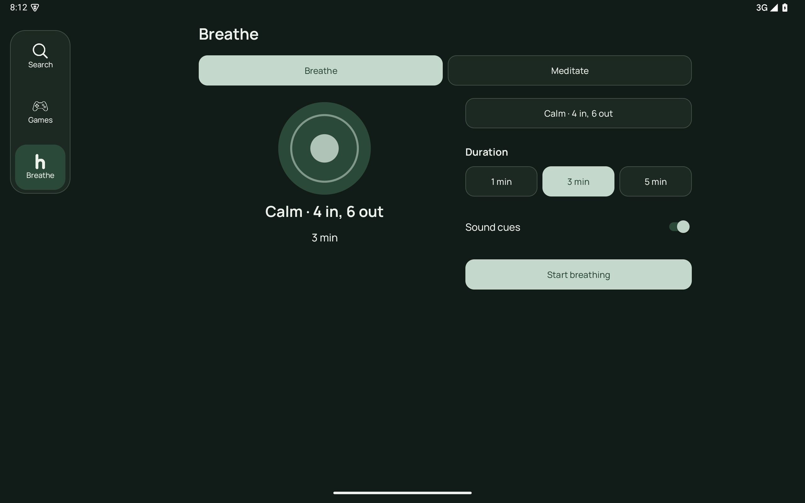
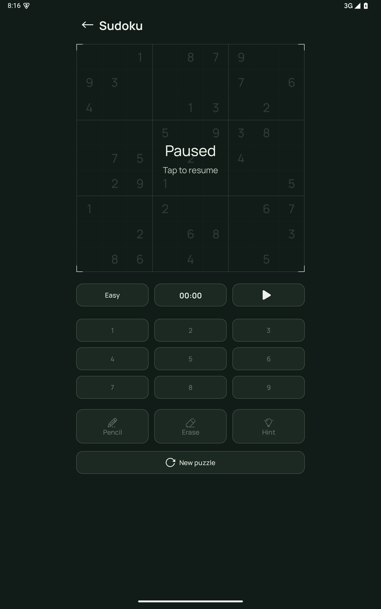

# Tablet spacing and alignment review

This pass fixes the native Android layouts. The gallery contains emulator captures, not generated mockups.

## Changes

| Area | Previous behavior | Corrected behavior |
|---|---|---|
| Shared page gutters | Padding changed inside the layout callback; children could be clipped against the new padding before remeasurement. | Defer padding changes until after traversal, then remeasure. This applies to Home, Games, Breathe, History, Downloads and shared bounded content. |
| Two-pane content | Equal slots contained individually centered columns, adding hidden whitespace to the visible gap. | Allocate bounded pane widths from their preferred content sizes. The visible gap is 24dp; pane tops align. |
| Home | Header and dashboard had different leading edges; hero/search inherited equal-slot whitespace. | Shared 560dp compact / 1064dp expanded page bounds, with packed hero/search panes. |
| Individual games | Portrait windows forced narrow side-by-side boards and controls; board/tools had different widths when stacked. | Stack below 840dp of available content width. Compact page width is at most 480dp; expanded board/control group is at most 864dp. Stacked sections share their width and leading edge. |
| Games hub | Cards and title inherited inconsistent bounds and clipped leading text. | Shared 960dp page bound, minimum 56dp header height and remeasured gutters. |
| Snake | Score counters sat above the board while playback actions were isolated in the other pane. | Group counters and playback actions together in the controls pane. Board starts at the pane top. |
| Breathe / Meditate | Mode tabs spanned the page while the visual and controls floated in distant centered slots; title height could collapse. | Header, mode tabs and content share a 480dp compact / 784dp expanded bound. Minimum 56dp header, packed 400dp visual and 360dp controls with a 24dp gap. |
| Saved / playlist detail | The host and nested playlist list each supplied horizontal gutters. | Hosted playlists use the host gutter once, aligning title, actions and content. Library section headings lose their extra 8dp inset. |
| Profiles | Avatar rows added 12dp horizontal padding inside the already padded modal list. | Avatar, list and modal header use the same leading content edge; vertical row padding remains. |
| Search | Resize callbacks changed search/result padding during layout. | Defer adaptive search updates until after layout. |
| History, Settings, Downloads, Watch and floating playback | Needed review against the adjusted shared layout rules. | Recapture native screens and preserve existing independent scrolling, minimum touch targets, decoder and fullscreen behavior. |

## Responsive rules

Sizing follows the available content width and text scale. The 840dp game breakpoint applies after page gutters; an 800dp portrait window therefore stacks its board and controls. At 200% text, panes stack regardless of width. Content beyond the available height scrolls; controls are captured separately where necessary.

Top-level navigation keeps its existing rail/bottom behavior and equal bottom margins. Expanded Watch and fullscreen retain their existing navigation-free layout. Floating video, audio controls, privacy state and native playlists remain functional.

## Verification

The navigation instrumentation now checks actual rendered pane edges, widths and section gaps for every individual game. Existing tests exercise native route changes, modal/keyboard layouts, long playlist titles, settings categories, resizing, floating playback, expanded Watch and fullscreen with a real local video decoder.

Validation results and reviewed captures are recorded below. Download captures cover the available empty state; active network download missions are not newly exercised in this spacing pass. Test playlist metadata and color-bar video are temporary fixtures, cleaned up by the tests.

[Implementation gallery](assets/hush-tablet-implementation-proof/gallery.html)

## Final results — October 1, 2026

Build succeeded. All 27 JVM tests passed. Each window passed its four navigation/library/modal/alignment scenarios and all three final checks (window presentation, actual decoder continuity and settled Downloads centering): 28 validated emulator scenarios across four configurations.

| Configuration | Navigation and alignment | Final window / playback / Downloads |
|---|---|---|
| 1280×800dp landscape | 4 passed | 3 passed |
| 800×1280dp portrait | 4 passed | 3 passed |
| 600×900dp narrow window | 4 passed | 3 passed |
| Portrait at 200% text | 4 passed | 3 passed |

The initial landscape decoder test reached the close assertion before the bottom-sheet animation settled. The test now waits for the actual collapsed/closed state with a five-second deadline instead of a fixed 600ms delay. All final decoder runs passed; the first failure log is retained. A Downloads screenshot caught during activity transition was replaced with a settled standalone capture.

The gallery has 313 selected captures: 308 from this spacing review and five existing real YouTube playback captures. Every new capture was visually reviewed in contact sheets, with full-resolution inspection of clipping and transition cases. Network result grids retain the reviewed capture with loaded thumbnails rather than the final decoder run's partially loaded grid. Geometry fixtures marked “layout” deliberately contain no loaded video.

Run logs: `assets/hush-tablet-implementation-proof/spacing-review/` and `spacing-final-check/`. This turn's source patch and change inventory are `.zcode/tablet-spacing.patch` and `.zcode/tablet-spacing-changes.json`.

## Selected corrected screens

Landscape session: shared page edges and packed visual/controls panes.

Portrait game: bounded board and controls stacked on the same leading edge.

Narrow Downloads: settled activity with centered empty state and readable gutters.

Large-text History: scrolling header and content remain within page gutters.

